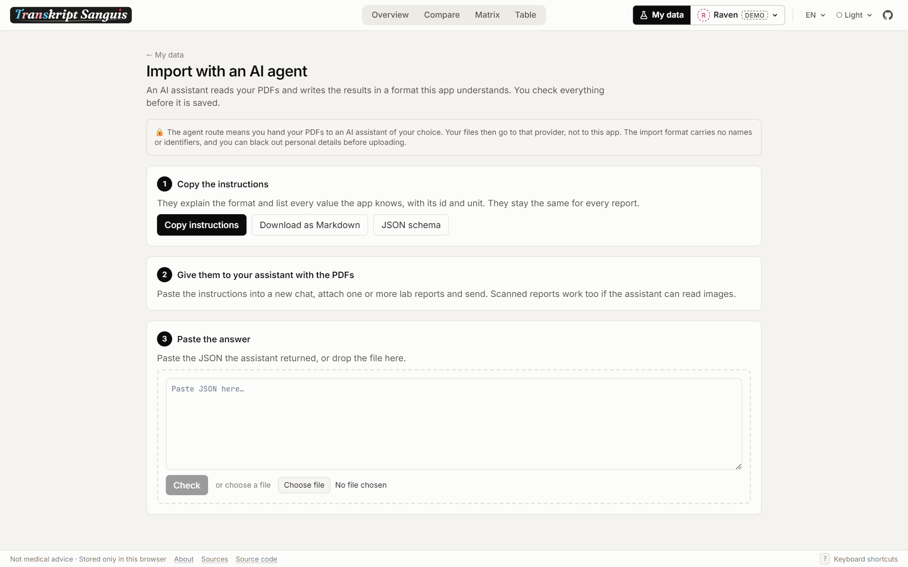

<div align="center">

<picture>
  <source media="(prefers-color-scheme: dark)" srcset="docs/assets/logo-dark.png">
  
</picture>

**Your blood test results over time, next to reference ranges that actually fit you.**

Built for people on hormone therapy, useful for everyone else too.

### [Open transkript-sanguis.henkys.dev](https://transkript-sanguis.henkys.dev)

[](LICENSE)


<picture>
  <source media="(prefers-color-scheme: dark)" srcset="docs/assets/overview-dark.png">
  
</picture>

</div>

Lab reports print one reference range, usually for cis men or cis women, and on hormone therapy neither of them fits. Transkript Sanguis puts every value you ever had measured on one timeline, next to HRT targets, ranges measured in trans people on stable HRT, clinical cutoffs, both cis ranges and the range your lab printed. Every number comes with its source.

## How to use

1. **Look around first.** Open the page and pick one of four made up demo profiles: a cis woman, a cis man, feminizing and masculinizing HRT.
2. **Create your profile.** Name, sex assigned at birth, HRT (feminizing, masculinizing or none) and your medication timeline.
3. **Add your results.** Type them in by hand, or let an AI assistant of your choice transcribe your PDFs and paste its answer. The app checks every value before it is saved.
4. **Read the charts.** Switch reference contexts, units and axes, compare values, open any value for the full story.
5. **Keep a backup.** Everything lives in your browser, so export a file now and then.

## Features

- **Researched references** - about 100 values, each with HRT targets, ranges from trans cohorts, clinical cutoffs, cis female and cis male ranges (age banded where it matters) and the printed lab range. Every range cites its guideline, study or assay sheet.
- **Explained in plain words** - what each value is, why it is measured and what HRT changes, in English and German.
- **Medication timeline** - phases and regimen changes drawn onto every chart, time counted from the start of HRT if you like.
- **Five views** - overview grid, compare (% of range, index or z-score), matrix heatmap, sortable table with CSV and JSON export, and a focus page per value.
- **Computed series** - eGFR (both CKD-EPI equations and from cystatin C), calculated free testosterone, free androgen index, non-HDL, HOMA-IR, transferrin saturation, BMI.
- **Values as printed** - stored exactly as on the report, converted on the fly between conventional and SI units.
- **AI import** - instructions and a JSON schema generated from the catalogue. The format has no fields for names or identifiers, and a preview flags odd values, units, ranges and duplicates before anything is saved.
- **Consistency checks** - recompute red cell indices, lipids, FAI, HbA1c and eGFR from your own numbers to catch typos.
- **Several profiles** - for you, your partner, your friends, all in one browser. Each keeps its own PDFs.
- **Installable and offline** - a PWA that keeps working without a connection.
- **Light and dark, animated or still** - charts draw themselves and glide when scales change, one switch turns every animation off and the system's reduced motion setting is respected.

## Screenshots

<p align="center">
  <picture>
    <source media="(prefers-color-scheme: dark)" srcset="docs/assets/focus-dark.png">
    
  </picture>
  <picture>
    <source media="(prefers-color-scheme: dark)" srcset="docs/assets/compare-dark.png">
    
  </picture>
  <picture>
    <source media="(prefers-color-scheme: dark)" srcset="docs/assets/matrix-dark.png">
    
  </picture>
  <picture>
    <source media="(prefers-color-scheme: dark)" srcset="docs/assets/agent-dark.png">
    
  </picture>
</p>

## Your data stays yours

- **No backend.** No account, no server, no analytics, no external fonts or scripts. Profiles live in localStorage, PDFs in IndexedDB.
- **Enforced, not promised.** The content security policy only allows connections to the page's own origin, so the app cannot send your data anywhere even by accident.
- **Your choice to share.** The AI import is the one route where files leave your device, to the assistant you pick. You can black out personal details first.

> [!IMPORTANT]
> **Not medical advice.** The ranges and texts are collected from guidelines, studies and assay method sheets and cited on every value. They do not replace your doctor. Talk to them before changing anything about your treatment.

## Host it yourself

The build is a static single page app. With Docker:

```sh
docker compose up -d --build   # http://localhost:8080
```

The image builds with bun and serves the files from an unprivileged nginx with SPA fallback, security headers and no access log. Any other static host works too: serve `build/` and fall back to `200.html` for unknown paths.

## Data formats

| Path | What it is |
| --- | --- |
| `/agent-instructions.md` | The prompt for AI assistants, generated from the catalogue |
| `/import-schema.json` | JSON schema of `transkript-sanguis/draws` v2, deliberately without personal fields |
| Backup files | `transkript-sanguis/export` v2: profiles and, optionally, the attached PDFs |

Older v1 files still import.

## AI disclosure

This project was built with a lot of help from Claude (Anthropic). I set the direction, researched and checked the medical side, reviewed the code and tested it with my own results. Every reference range still has to cite a real source, no model guessed a single number.

## Development

SvelteKit with Svelte 5, Tailwind 4 and TypeScript, [bun](https://bun.sh) as package manager and test runner.

```sh
bun install
bun run dev          # http://localhost:5173
bun run check        # types
bun run lint
bun run test:unit    # catalogue, units, formulas, parsing
npx playwright test  # end to end against a production build
bun run build        # static site in build/
```

- Set `CHROMIUM` to a Chrome executable if Playwright's pinned browser is not installed. The e2e tests fail on any console error, which catches CSP violations.
- `node scripts/icons.ts` renders the PNG app icons from `static/favicon.svg`.
- `node scripts/readme.ts` renders the images in this README from the demo profiles against a running app (`BASE`, default `http://localhost:5173`).

Decisions and conventions live in [CLAUDE.md](CLAUDE.md) and the project skills under `.claude/skills/`.

## License

MIT. See [LICENSE](LICENSE).
