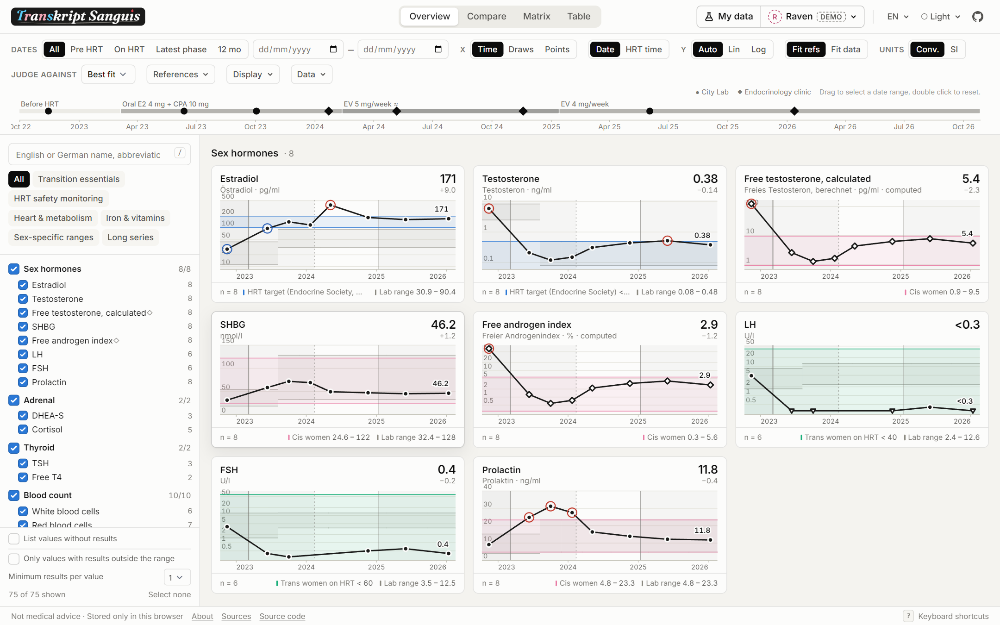
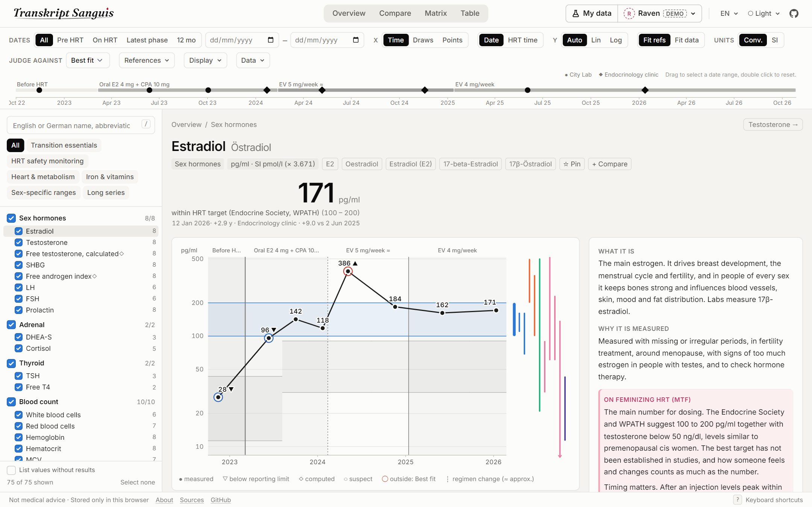
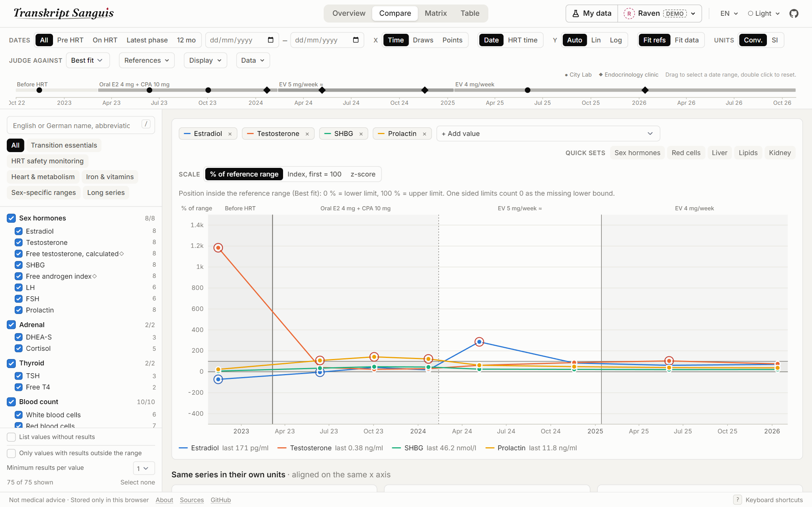
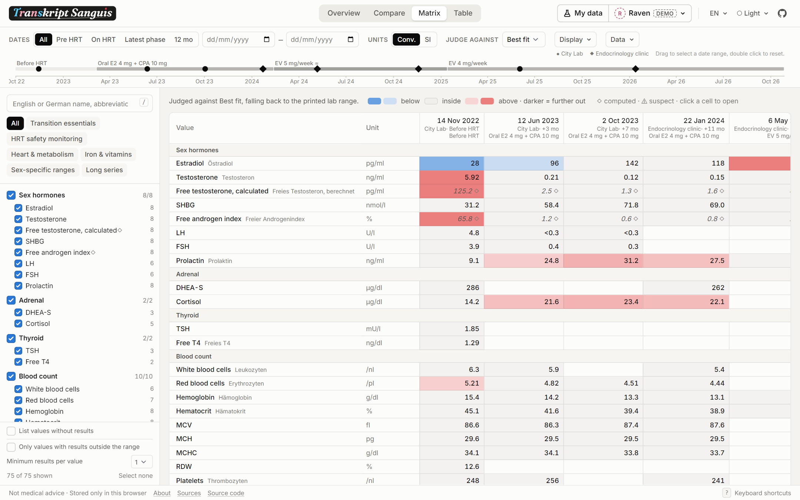
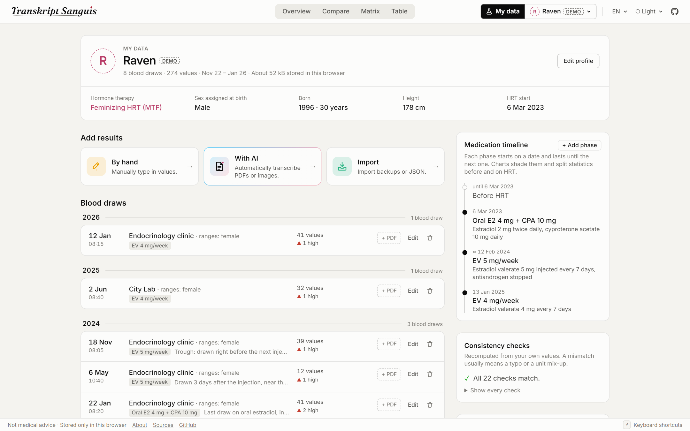

<div align="center">
<br>
<picture>
  <source media="(prefers-color-scheme: dark)" srcset="docs/assets/logo-dark.png">
  
</picture>

**An open source app for tracking and analyzing blood tests, with hormone therapy support.**

<a href="https://transkript-sanguis.henkys.dev"><b>Open in Browser</b></a>
&nbsp;&nbsp;&bull;&nbsp;&nbsp;
<a href="https://github.com/telefonsquid/transkript-sanguis/releases/latest"><b>Download Desktop App</b></a>

<br>

<picture>
  <source media="(prefers-color-scheme: dark)" srcset="docs/assets/overview-dark.png">
  
</picture>

</div>
<br>

Transkript Sanguis is an open source application for tracking and analyzing blood tests. It charts your results over time and compares them to reference ranges sourced from published research with additional information about every single value. None of your data ever touches a server, everything is kept and analyzed locally on your machine.

🏳️‍⚧️ It has additional support for feminizing and masculinizing hormone therapy by offering profiles, ranges from trans-specific resources and treatment targets, a medication timeline laid over the charts and notes on how the therapy affects each value.

> [!IMPORTANT]
> **Not medical advice.** The ranges and texts are collected from guidelines, studies and assay method sheets and cited on every value. They do not replace your doctor.

<!-- downloads -->

## Download

| | x64 (Intel, AMD) | arm64 (Apple Silicon, Snapdragon) |
| :-- | :-- | :-- |
| **Windows** | [](https://github.com/telefonsquid/transkript-sanguis/releases/download/v1.0.1/transkript-sanguis_1.0.1_windows_x64_portable.exe) [](https://github.com/telefonsquid/transkript-sanguis/releases/download/v1.0.1/transkript-sanguis_1.0.1_windows_x64_setup.exe) [](https://github.com/telefonsquid/transkript-sanguis/releases/download/v1.0.1/transkript-sanguis_1.0.1_windows_x64.msi) | [](https://github.com/telefonsquid/transkript-sanguis/releases/download/v1.0.1/transkript-sanguis_1.0.1_windows_arm64_portable.exe) [](https://github.com/telefonsquid/transkript-sanguis/releases/download/v1.0.1/transkript-sanguis_1.0.1_windows_arm64_setup.exe) |
| **macOS** | [](https://github.com/telefonsquid/transkript-sanguis/releases/download/v1.0.1/transkript-sanguis_1.0.1_mac_x64.dmg) | [](https://github.com/telefonsquid/transkript-sanguis/releases/download/v1.0.1/transkript-sanguis_1.0.1_mac_arm64.dmg) |
| **Linux** | [](https://github.com/telefonsquid/transkript-sanguis/releases/download/v1.0.1/transkript-sanguis_1.0.1_linux_x64.AppImage) [](https://github.com/telefonsquid/transkript-sanguis/releases/download/v1.0.1/transkript-sanguis_1.0.1_linux_x64.deb) [](https://github.com/telefonsquid/transkript-sanguis/releases/download/v1.0.1/transkript-sanguis_1.0.1_linux_x64.rpm) | [](https://github.com/telefonsquid/transkript-sanguis/releases/download/v1.0.1/transkript-sanguis_1.0.1_linux_arm64.AppImage) [](https://github.com/telefonsquid/transkript-sanguis/releases/download/v1.0.1/transkript-sanguis_1.0.1_linux_arm64.deb) [](https://github.com/telefonsquid/transkript-sanguis/releases/download/v1.0.1/transkript-sanguis_1.0.1_linux_arm64.rpm) |

<!-- /downloads -->

> **macOS** – Builds are unsigned: right-click the app and choose Open on first launch, or macOS refuses it outright.

## Features

- Collects and charts blood test results over time
- Reference ranges for cis women, cis men, feminizing and masculinizing HRT, trans cohorts, clinical cutoffs and the lab's printed range, each citing its source
- All data stays on your device, in the browser or the desktop app, and is never sent to a server
- 100+ values and reference ranges
- Customizable medication timeline
- Consistency checks for typing and parsing errors
- Enter results by hand or let an AI assistant transcribe your lab reports
- Multiple profiles
- Desktop app for Windows, macOS and Linux, or install the web version as a PWA
- Conversion between conventional and SI units
- Computed values: eGFR, calculated free testosterone, free androgen index, HOMA-IR and others

## Screenshots

<p align="center">
  <picture>
    <source media="(prefers-color-scheme: dark)" srcset="docs/assets/focus-dark.png">
    
  </picture>
  <picture>
    <source media="(prefers-color-scheme: dark)" srcset="docs/assets/compare-dark.png">
    
  </picture>
  <picture>
    <source media="(prefers-color-scheme: dark)" srcset="docs/assets/matrix-dark.png">
    
  </picture>
  <picture>
    <source media="(prefers-color-scheme: dark)" srcset="docs/assets/data-dark.png">
    
  </picture>
</p>

## Feedback

Found a range that looks wrong, a text that is misleading or contradicts another, a unit that does not convert or any other bug? Missing a value or a feature? Please [open an issue](https://github.com/telefonsquid/transkript-sanguis/issues/new). For ranges and texts, name the value and add a source if you have one. Leave your own results and anything that identifies you out of it.

## Host it yourself

The build is a static single page app. With Docker:

```sh
docker compose up -d --build   # http://localhost:8080
```

The image builds with bun and serves the files from an unprivileged nginx with SPA fallback, security headers and no access log. Any other static host works too: serve `build/` and fall back to `200.html` for unknown paths.

## AI disclosure

> This project was supported by AI-assisted coding tools. In fact, about 90% of the code was generated using Claude Opus 5.5. I am a full stack developer and have been working with SvelteKit for years, so there was a lot of direction and code review involved. I'm all too aware and concerned about the negative effects of AI on society, the environment, and the world as a whole and in no way endorse it. Yet, while I had a project like this planned for years now, I would've never found the required time to see it through. So take it with a grain of salt but AI allowed this project to exist in the first place.

## Development

SvelteKit with Svelte 5, Tailwind 4 and TypeScript, [bun](https://bun.sh) as package manager and test runner.

```sh
bun install
bun run dev          # http://localhost:5173
bun run check        # types
bun run lint
bun run test:unit    # catalogue, units, formulas, parsing
npx playwright test  # end to end against a production build
bun run build        # static site in build/
bun run tauri dev    # desktop app against the dev server
bun run tauri build  # desktop app and installers in src-tauri/target/release/
```

- Set `CHROMIUM` to a Chrome executable if Playwright's pinned browser is not installed. The e2e tests fail on any console error, which catches CSP violations.
- The desktop app needs [Rust](https://rustup.rs) and the [Tauri prerequisites](https://v2.tauri.app/start/prerequisites/). Releases are built by CI from a version tag, see Releasing in [CLAUDE.md](CLAUDE.md).
- `node scripts/icons.ts` renders the web and desktop app icons from `static/favicon.svg`.
- `node scripts/readme.ts` renders the images in this README from the demo profiles against a running app (`BASE`, default `http://localhost:5173`).

Decisions and conventions live in [CLAUDE.md](CLAUDE.md) and the project skills under `.claude/skills/`.

## License

MIT. See [LICENSE](LICENSE).
